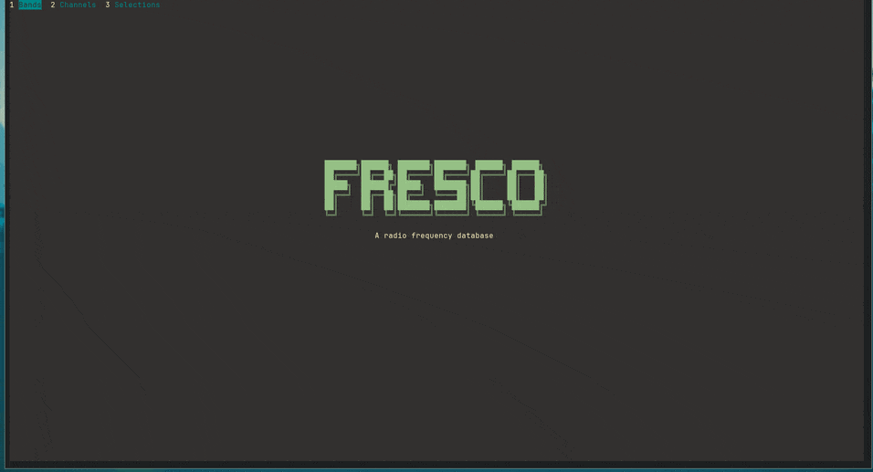

# fresco
A radio frequency database

[Radio bands list](datasets/bands.fwf)

## Build and release
```
# only direnv and devenv.sh
export GITHUB_TOKEN=$(pass show home/bruno/github.com/token/goreleaser)
task clean build release
```



**Bands source**:
- [SDR++](https://github.com/AlexandreRouma/SDRPlusPlus/tree/master/root/res/bandplans)
- [Gqrx](https://raw.githubusercontent.com/gqrx-sdr/gqrx/master/resources/bandplan.csv)
- [Wikipedia](https://en.wikipedia.org/wiki/Frequency_allocation)
- [CEPT](https://efis.cept.org/sitecontent.jsp?sitecontent=ecatable)
- [ANFR](https://www.anfr.fr/fileadmin/mediatheque/documents/ANFR/ANFR-spectre-frequences-juin-2020.pdf)
- [ANFR](https://www.anfr.fr/fileadmin/mediatheque/documents/tnrbf/TNRBF_2021-05-04.pdf)
- [IEEE](http://www.classic.grss-ieee.org/frequency_allocations.html)
- [ITU](https://www.itu.int/en/publications/ITU-R/pages/publications.aspx?parent=R-REG-RR-2020&media=electronic)
- [ITU](https://www.itu.int/en/ITU-R/terrestrial/fmd/Pages/frequency-plans.aspx)
- [hackrf](https://github.com/pavsa/hackrf-spectrum-analyzer/blob/master/src/hackrf-sweep/src-java/resources/freq-europe.csv)
- [ctu](https://spektrum.ctu.cz/en/band)

